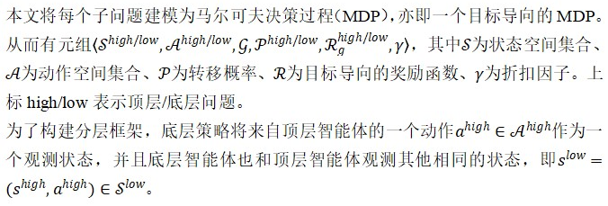

基于分层强化学习的自适应与可解释导航技能部署

学习一系列底层导航策略，以及一个使用策略的顶层策略。对顶层策略进行训练，实现自适应地使用最合适的导航技能。顶层策略根据原始传感器的观测状态，唤醒不同的底层导航技能。

1 问题建模
分层强化学习（HRL）将RL问题分解为多重子问题，子问题为RL问题。本文将学习导航技能这一问题分解为2个子问题，即1个顶层问题，1个底层问题。
顶层问题旨在找到一个宏观策略（macro policy），对导航环境进行理解，决定采取何种导航技能。宏观策略观测当前状态，具体化智能体遇到的环境情景；底层问题旨在发现导航策略，驱使移动机器人到达目标位置。
