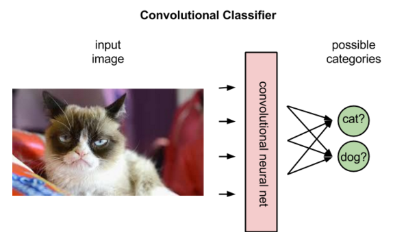
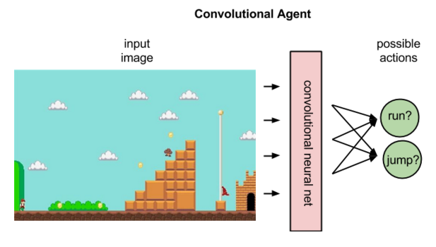

### 强化学习中的神经网络
神经网络是学习如何将 状态－动作对 映射至奖励的主体。强化学习的神经网络用系数来模拟输入与输出之间的关联函数，在学习过程中沿着有可能降低的梯度反复调整系数，亦即权重，直至找到一组最合适的权重。

### 卷积网络
卷积网络是为识别二维形状而特殊设计的一个多层感知器，这种网络结构对平移、比例缩放、倾斜或者共他形式的变形具有高度不变性。

在强化学习中，卷积网络可用于识别一个主体的状态，例如马里奥所在的画面、一架无人机前方的地形等。这也就是说，卷积网络在执行它们经常承担的图像识别任务。

但是，卷积网络在强化学习中对图像的解析方式与在有监督学习中不同。在有监督学习中，网络会给图像添加标签，也就是将名称与像素匹配。具体来说，网络会根据标签与图像匹配的概率来对标签进行排序。读取到一幅驴的图像时，网络或许会判定该图片有80%的可能性是驴，有50%的可能性是马，有30%的可能性是狗。

在强化学习中，卷积网络可根据输入的代表某一状态的图像来对该状态下的潜在动作进行排序；比如网络或许会预测出向右跑可得5分，跳跃可得7分，向左跑无法得分。

开始进行强化学习时，神经网络的系数可随机初始化。依据环境给予的反馈，神经网络可以用预测的奖励和实际奖励之差来调整权重，改进其对状态－动作对的解析。

有监督学习开始时，神经网络尝试预测的标签的实际基准是已知的。有监督学习的目的是得到一个能将不同图像映射至各自名称的模型。

强化学习则依赖环境发出一个标量数值（奖励），作为对于每次新动作的反馈。环境所返回的奖励有可能出现差异、延时，或者受到未知变量的影响，从而将噪声引入反馈循环。