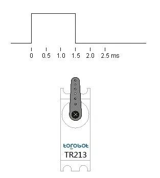
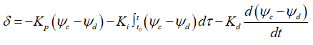

【目标】对于不同舵角、转速，采用PID算法进行试验（回转、Z形），并记录 舵角、转速、船速、加速度

电机的转速只受PWM信号控制，PWM输出50车速就是50；但是当电池电量不足、或载重量增加时，PWM同样输出50，车速就不再是50了。所以为了保证车速是一个确定的数，需要不断调整PWM输出。想要调节电机的转速，只需要控制电机两端的电压即可。

通过改变 占空比 可以实现调压，占空比越大，所得到的 平均电压 也就越大；占空比越小，所得到的平均电压也就越小。只要改变PWM信号的占空比，就可以改变直流电机两端的平均电压，从而实现直流电机的调速。

舵机控制信号周期为20ms（1/0.02s = 50Hz）的PWM信号，脉冲宽度从0.5ms~2.5ms，对应舵盘0~180°，为线性变化。给舵机提供一定的脉宽，其输出轴就会保持在一个相对应的角度上，直到给它提供一个另外宽度的脉冲信号，输出轴才会改变角度。

初始位置（0°） => 0.5ms 的脉冲宽度 => 占空比 0.5ms / 20ms = 2.5％

中间位置（90°）=> 1.5ms 的脉冲宽度 => 占空比 1.5ms / 20ms = 7.5％

最终位置（180°）=> 2.5ms 的脉冲宽度 => 占空比 2.5ms / 20ms => 12.5％

所以占空比范围：2.5％~12.5％

角度（°）与占空比的转换：占空比 = ( 2.5 + 角度/180 * 10 ) % 

=====================================================

PID控制算法具有结构简单和稳定性好等优点，基本控制规律为：

Kp、Ki和Kd分别代表比例系数、积分系数和微分系数，ψc代表船舶的航向角，ψd代表期望航向角，t0代表初始时刻，一般取零，t代表当前时刻，δ代表经过PID控制算法设定的船舶舵角值。
