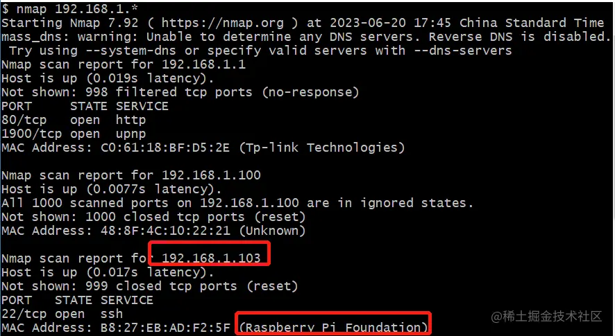
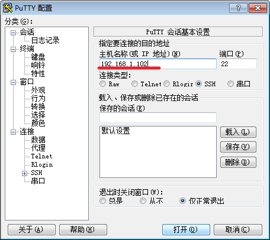
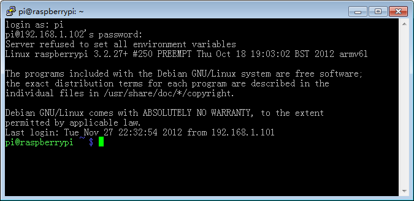

（1）树莓派查看ip地址是用命令ifconfig，而Windows的cmd命令查看ip地址是ipconfig。如果使用nmap工具来扫描树莓派的IP地址，指令：nmap 192.168.1.*

（2）通电开机后在路由器后台查询树莓派的IP地址, “raspberrypi”就是树莓派主机名，获取其IP地址（192.168.X.X）

（3）下载PuTTY，PuTTY是一款免费的远程登录工具，轻盈小巧、无需安装，操作简单易上手，非常适合用来远程管理Linux

（4）在输入栏内输入刚获取的ip地址选择SSH模式点击Open。进入到命令行界面，输入树莓派用户名pi，确认回车输入密码raspberry（密码输入时不显示）回车，此时就远程登录树莓派的命令行界面。

（5）SSH连接后输入 sudo apt-get install xrdp。等待安装配置完成后在windows打开远程桌面连接，输入用户名、密码确认就可以远程桌面登录到树莓派的操作桌面。